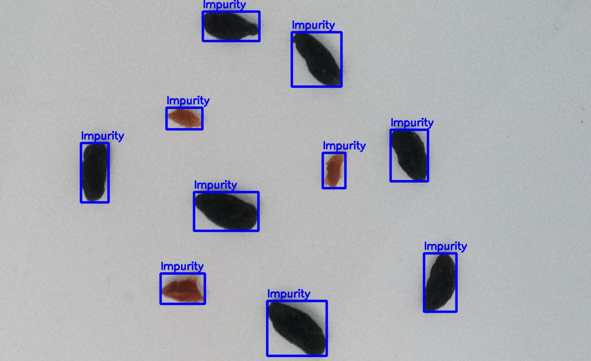

# 📘 OAK-D Color-Based Impurity Detection System

A real-time computer-vision application for detecting black and brown impurities on industrial white surfaces using an OAK-D (DepthAI) camera.
This system performs HSV color segmentation, contour extraction, and live annotation to highlight impurities on the conveyor.

## ✨ Features

Real-Time Detection using OAK-D camera

Color Segmentation for brown + black impurities

Contour-Based Bounding Boxes

MP4 Video Recording of annotated frames

Modular Structure (main.py + util.py)

Lightweight Dependencies (OpenCV + DepthAI)

## 🛠️ Technologies Used

DepthAI (OAK-D) for RGB stream

OpenCV for image processing

NumPy for matrix operations

Python for pipeline implementation

## 📋 Prerequisites

Python 3.8+

OAK-D / OAK-D-Lite camera

## Required libraries in requirements.txt:

opencv-python
numpy
os
depthai==2.30.0.0

## 📦 Installation & Virtual Environment Setup

1. Create and activate a virtual environment:

python -m venv .venv

Windows:

.venv\Scripts\activate.bat

2. Install dependencies:

pip install -r requirements.txt

##▶️ Running the Application

Make sure your OAK-D is connected via USB.

Run this command:

python src/main.py

Press Q to quit the real-time viewer.

📂 Project Structure
├── src/
│   ├── main.py               # Main OAK-D detection script
│   └── util.py               # HSV threshold helper function
│
├── example/
│   └── detection_sample.jpg  # Output screenshot
│
├── output/
│   └── output.mp4            # Auto-generated video file
│
├── requirements.txt
└── README.md

## 🎨 Example Output

A sample detection image:

Click the link below to watch the demo:
[Demo](output/output.mp4)

## 🧩 How the System Works

Capture frame from OAK-D

Convert BGR → HSV

Load impurity thresholds from util.py

Create binary masks

Extract contours

Draw bounding boxes

Save & show annotated frames

You can easily extend detection to more colors (yellow, red, blue, etc.) by adding ranges to get_limits().
